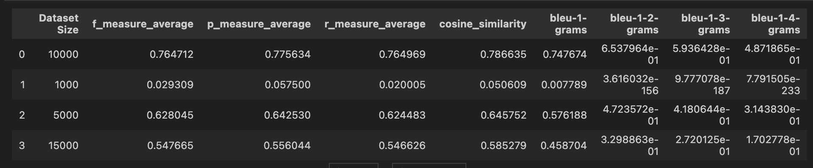

  

# **End to End Machine Translation System**

  

  
## Overview
In this article I will walk you through the machine learning project that is able to translate sentences from hindi to english. This project has all the key components that are necessary for an end to end machine learning pipeline.

  

This has 3 key components: client , server, machine-learning

  

  

**client**: a mobile application based on javascript framework : react native. The application communicates with the server via API to translate sentences from hindi to english

  

  

**server**: build with Fast API , a popular web framework for python. The API endpoint: /predict

  

is made available that takes sentences as params to make the translation.

  

  

**machine-learning**: it consist of the program that trains the model; machine translation evaluations (BLEU , ROUGE scores ).

  

  

## **Training the Model**

  

  

**Training Data**:

  

We have used the parallel corpus from [IIT Bombay English-Hindi Translation Dataset](https://www.cfilt.iitb.ac.in/iitb_parallel/). The size of our training dataset is 15000. 10% of our data is used for testing

  

  

**Preprocessing**:

  

1.  **Lowercasing**: Standardizing characters to lowercase for uniformity.
2.  **Number Removal**: Eliminating numerical figures to streamline text for translation purposes.
3.  **Tokenization**: Segmentation of sentences into tokens for both source and target languages.
4.  **Integer Encoding**: Converting sentences into integer sequences for efficient processing.
5.  **Fixed-Length Sequences**: Maintaining a consistent sequence length of 15 ensures uniform input for the model.

\
\
**Model Architecture**:

The model is based on LSTM (Long Short Term Memory) which is a type of recurrent neural network (RNN) . LSTM networks can remember long-term dependencies in sequential data, making them well-suited for machine translation tasks. They are able to do this by using a series of memory cells, which can be selectively updated or forgotten based on the input data. This allows the network to learn patterns in the input data over time, and to use this knowledge to make better translations.

  

In this project we have used the encoder-decoder architecture for translation. The encoder LSTM network takes in the input sentence and produces a fixed-length vector representation of the sentence, which is then passed to the decoder LSTM network. The decoder LSTM network takes the encoder's output vector as input and generates the translated sentence word by word.

## Performance on Different Model Size

# Find More About Each Components on their separate READMEs:

1. [Client README](client/README.md)
2. [Server README](server/README.md)
3. [Machine Learning README](machine-learning/README.md)

######

# Future Works:

1. Train on models like BERT and GPT
2. Evalaute metrics (ROUGE, BLEU) on  models like BERT and GPT
3. Update client side to take Hindi as input 

# Keywords

  

  

Machine Translation , NLP,  Machine Learning, BLEU, ROUGE, F-Measure, Tensorflow, FAST API ,React Native, 

  

## Resources

1. [Presentation on Scoring Metrics for Machine Translation](https://docs.google.com/presentation/d/1ZqmvAtzmWV7W_1xAPnKYeBNufQxC0IOZ6O04XUmCfzQ/edit?usp=sharing)
2.  [Presentation on Word Embedding](https://docs.google.com/presentation/d/1tZeBZNLOhsXCIZ42AxE_J87teR2ygbvxdESZzhFnPs8/edit?usp=sharing)

## Contact Me

For futher queries, you can contact me via email at :

  

[asif01050105@gmail.com](mailto:asif01050105@gmail.com "mailto:asif01050105@gmail.com")

  [1421015@iub.edu.bd](mailto:asif01050105@gmail.com "mailto:asif01050105@gmail.com")

**Asif Mahmud**
